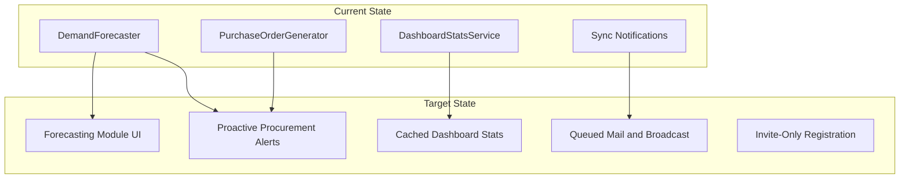

# System Improvement Analysis

> **PUP PRISM** — Property and Resource Inventory System Management  
> **Analysis date:** 2026-07-03  
> **Accuracy review:** 2026-07-03 — see [ACCURACY_REVIEW.md](./ACCURACY_REVIEW.md)  
> **Stack:** Laravel 13, Inertia v3, Vue 3, Fortify, Spatie RBAC, Reverb, Pest 4

---

## Executive Summary

PUP PRISM is a mature, university-focused inventory and procurement platform for PUP's Supply and Property Management Office (SPMO). The system covers the full operational lifecycle: product catalog, stock receiving (including batch and QR), requisitions with approval/issue workflows, asset bookings, accountable handovers with signature verification, supplier and purchase order management, demand forecasting, audit trails, CSV/PDF reports, real-time notifications, and a Sanctum REST API.

**What is already strong:** 195 Pest tests (verified 2026-07-03), Playwright E2E suites, role-based access at routes/policies/frontend, soft deletes with unified trash, email notifications for 7 workflow events, statistical demand forecasting with `forecast_stockout` alerts, forecast-aware PO quantity resolution, in-app notification center with Reverb, and real-time updates.

**Where improvement is needed:** Security hardening (open registration, permissive API policies, non-expiring tokens), **booking reject workflow bug**, surfacing existing intelligence (no dedicated forecasting UI), async infrastructure (synchronous mail/broadcast), dashboard query performance, production observability, and closing the forecast-to-PO loop for pre-threshold products.

**Strategic approach:** Prioritize security and authorization fixes first, then expose and automate existing forecasting intelligence, then optimize performance and operations. Avoid feature bloat — each recommendation solves a verified gap in the current codebase.



---

## Recommended Smart Features and Improvements

---

### Feature 1: Secure Registration & Admin User Provisioning

#### 1. Feature Name

Secure Registration & Admin User Provisioning

#### 2. Current Problem or Limitation

Fortify registration is enabled in `config/fortify.php`. `app/Actions/Fortify/CreateNewUser.php` creates users with name, email, and password but assigns **no Spatie role**. Web inventory routes are protected by `role:Admin|Supply Head|Property Custodian` middleware, so roleless users cannot use inventory via the web UI. However, roleless users can still reach `/dashboard`, create accounts without organizational assignment, and — if they obtain a Sanctum token — `POST /api/requisitions` because `RequisitionPolicy::create()` returns `true` (the API controller does call `authorize('create')`, but the policy permits all authenticated users). This is inappropriate for an internal university system.

#### 3. Why This Feature Matters

Unauthorized account creation is the highest security risk. Without admin-controlled provisioning, the system cannot enforce organizational structure (department, position, role) at account creation time.

#### 4. Recommended Solution

- Add `REGISTRATION_ENABLED` env flag; disable Fortify `Features::registration()` when false (default false in production `.env.example`).
- Create Admin-only user management: list, create, update, deactivate users with required role assignment and optional `position_id`.
- Add `verified` middleware to `routes/api.php`.
- Audit all user lifecycle changes via `AuditLogService`.

#### 5. Smart System Enhancement

Admin provisioning wizard with role-based defaults (e.g., Property Custodian auto-suggested for department positions). Prevents misconfigured accounts and reduces manual IT support.

#### 6. Technical Implementation Details

**Backend:**
- `UserManagementController` with `index`, `create`, `store`, `edit`, `update`, `deactivate`
- `StoreUserRequest`, `UpdateUserRequest` with validation: unique email, strong password, role in `Admin|Supply Head|Property Custodian`
- Migration: optional `users.is_active` (boolean, default true), `users.invited_at` (nullable timestamp)
- Routes under `/admin/users` with `role:Admin` middleware
- Toggle Fortify registration in `FortifyServiceProvider` or `config/fortify.php` based on env

**Frontend:**
- `resources/js/pages/admin/users/Index.vue`, `Create.vue`, `Edit.vue`
- Role select, position select (from existing departments/positions)
- Wayfinder routes; add nav item visible only to Admin

**Security:**
- Only Admin can access; deactivate instead of hard-delete to preserve audit integrity
- Log create/update/deactivate in audit_logs

**Error handling:**
- Return 403 for non-admin; validation errors via Inertia
- Prevent deactivating the last Admin account

**Edge cases:**
- Email already exists → validation error
- User with active requisitions/bookings → warn before deactivate
- Self-deactivation by Admin → block

#### 7. Expected Benefits

- **Security:** Eliminates unauthorized self-registration
- **UX:** Clear onboarding path for new staff
- **Maintainability:** Centralized user administration
- **Data accuracy:** Role and position assigned at creation

#### 8. Priority Level

**Critical**

#### 9. Implementation Complexity

**Medium**

#### 10. Risk Level

**Medium** — Main risk: locking out legitimate users if registration is disabled without admin access. Mitigate with seeded admin account and documented invite workflow.

---

### Feature 2: API & Sanctum Token Hardening

#### 1. Feature Name

API & Sanctum Token Hardening

#### 2. Current Problem or Limitation

`config/sanctum.php` sets `expiration` to `null` (tokens never expire). No token abilities/scoping. No UI to create or revoke tokens — tokens are only created in tests via `$user->createToken()`. API routes lack `verified` middleware. `RequisitionPolicy::create()` and `BookingPolicy::create()` return `true` for any authenticated user.

#### 3. Why This Feature Matters

A leaked API token grants permanent full access. Roleless users with tokens can create requisitions via `POST /api/requisitions`. Production integrations need scoped, expiring credentials.

#### 4. Recommended Solution

- Configure token expiration (e.g., 90 days via `SANCTUM_TOKEN_EXPIRATION`).
- Implement token abilities: `read`, `write` with Sanctum middleware `abilities:read`.
- Add Settings > API Tokens page for Admin and Supply Head.
- Tighten `create()` policies to require inventory roles.
- Add `verified` to API route group.

#### 5. Smart System Enhancement

Scoped read-only tokens for kiosk displays or external dashboards — integration-specific access without full account credentials.

#### 6. Technical Implementation Details

**Backend:**
- `config/sanctum.php`: `'expiration' => env('SANCTUM_TOKEN_EXPIRATION', 90 * 24 * 60)`
- `ApiTokenController` in Settings namespace: index, store, destroy
- `createToken('integration-name', ['read'])` with ability validation on routes

**Frontend:**
- `resources/js/pages/settings/ApiTokens.vue` — list tokens (name, abilities, last_used_at, expires_at), create form, revoke button

**API changes:**
- Group read endpoints with `abilities:read` or full token
- Write endpoints require `abilities:write` or full token

**Security:**
- Tokens shown only once on creation (plain text)
- Revoke on password change (optional Sanctum config)

**Tests:**
- Extend `tests/Feature/Api/ApiIntegrationTest.php`

#### 7. Expected Benefits

- **Security:** Reduced blast radius of leaked tokens
- **Scalability:** Safe third-party integrations
- **Maintainability:** Self-service token management

#### 8. Priority Level

**Critical**

#### 9. Implementation Complexity

**Medium**

#### 10. Risk Level

**Low** — Existing integrations (if any) need token refresh; document migration path.

---

### Feature 3: Authorization Consistency & Policy Bug Fixes

#### 1. Feature Name

Authorization Consistency & Policy Bug Fixes (Booking Reject Critical Bug)

#### 2. Current Problem or Limitation

`BookingPolicy` has no `reject()` method, which causes **two user-facing failures**:

1. **`bookings/Show.vue`** gates the reject button on `can.reject`, which calls `$user->can('reject', $booking)` — this returns **false** when the policy method is missing, so **the reject dialog never appears** for authorized approvers.
2. **`BookingController::bulkReject`** calls `$this->authorize('reject', $booking)` and will **403** on every booking.

Note: `BookingController::update()` uses `authorize('approve')` for both approve and reject actions, but the reject form is hidden behind the broken `can.reject` check.

Additional gaps: web `store()` methods in `BookingController`, `RequisitionController`, `HandoverController`, and `ReceivingController` skip explicit `authorize('create')` (web routes use role middleware as compensating control). `AuditLogPolicy` is not explicitly registered in `AuthServiceProvider` but works via Laravel policy auto-discovery.

#### 3. Why This Feature Matters

This is a **broken production workflow**, not just a defense-in-depth gap. Property Custodians and Admins cannot reject bookings from the UI. Bulk reject is also non-functional.

#### 4. Recommended Solution

- Add `reject(User $user, Booking $booking): bool` to `BookingPolicy` mirroring `approve()` with `BookingStatus::Requested` guard.
- Verify `bookings/Show.vue` reject button appears for Admin/Property Custodian on requested bookings.
- Optionally register `AuditLogPolicy` explicitly in `AuthServiceProvider` (hygiene).
- Add `$this->authorize('create', Model::class)` to web `store()` methods for defense-in-depth.
- Add Pest tests for single reject via update, bulk reject, and `can.reject` on Show page.

#### 5. Smart System Enhancement

Foundation for auto-generated authorization regression tests from `php artisan route:list` — prevents future policy/route drift.

#### 6. Technical Implementation Details

**Backend only** — no DB changes.

**Files:**
- `app/Policies/BookingPolicy.php`
- `app/Providers/AuthServiceProvider.php`
- `app/Http/Controllers/Inventory/BookingController.php`
- `app/Http/Controllers/Inventory/RequisitionController.php`
- `app/Http/Controllers/Inventory/HandoverController.php`
- `app/Http/Controllers/Inventory/ReceivingController.php`

**Tests:**
- `tests/Feature/Inventory/BookingTest.php` or new bulk test file
- `tests/Feature/Authorization/`

#### 7. Expected Benefits

- **Reliability:** Bulk reject works correctly
- **Security:** Consistent authorization layers
- **Maintainability:** Explicit policy registration

#### 8. Priority Level

**Critical** (booking reject is a broken user workflow)

#### 9. Implementation Complexity

**Low**

#### 10. Risk Level

**Low**

---

### Feature 4: Production Security Headers & Handover Signature Validation

#### 1. Feature Name

Production Security Headers & Handover Signature Validation

#### 2. Current Problem or Limitation

No security headers middleware (CSP, HSTS, X-Frame-Options). Handover signatures in `HandoverController` accept any string up to 300KB without validating PNG format — potential DoS and XSS if malformed data is stored/rendered in PDF. Verification tokens passed as URL query parameters may leak via referrer/logs.

#### 3. Why This Feature Matters

Security headers protect against clickjacking, MIME sniffing, and downgrade attacks. Signature validation prevents payload abuse. Token-in-URL is a common credential leakage vector.

#### 4. Recommended Solution

- `SecurityHeadersMiddleware`: X-Frame-Options DENY, X-Content-Type-Options nosniff, Referrer-Policy strict-origin-when-cross-origin, Strict-Transport-Security (production only).
- `HandoverSignatureValidator` service: require `data:image/png;base64,` prefix, decode, verify PNG magic bytes (`\x89PNG`), max 500KB decoded.
- Move verification token from GET query to POST body in `handover/Verify.vue`.

#### 5. Smart System Enhancement

Validated signatures enable future OCR or biometric audit without trusting arbitrary payloads.

#### 6. Technical Implementation Details

**Backend:**
- `app/Http/Middleware/SecurityHeadersMiddleware.php`
- Register in `bootstrap/app.php` web middleware stack
- `app/Services/Inventory/HandoverSignatureValidator.php`
- Update `HandoverController`, `HandoverVerificationController`

**Frontend:**
- `resources/js/pages/inventory/handover/Verify.vue` — POST token in body

**Validation rules:**
- Signature: required, string, valid PNG data URI, max decoded 512000 bytes

**Edge cases:**
- Empty signature pad → validation error before submit
- Corrupted base64 → graceful error message
- Existing handovers with valid signatures → unaffected

#### 7. Expected Benefits

- **Security:** Headers + input validation
- **Performance:** Reject oversized payloads early
- **Reliability:** Consistent handover verification

#### 8. Priority Level

**High**

#### 9. Implementation Complexity

**Low–Medium**

#### 10. Risk Level

**Low** — Test handover E2E flow after token transport change.

---

### Feature 5: Queued Notifications & Async Broadcasting

#### 1. Feature Name

Queued Notifications & Async Broadcasting

#### 2. Current Problem or Limitation

All 7 notification classes in `app/Notifications/` use `Queueable` but not `ShouldQueue` — they run synchronously. `InventoryRealtimeMessage` uses `ShouldBroadcastNow`, blocking HTTP responses on WebSocket delivery. Mail via Resend adds latency to user actions (approve requisition, submit booking).

#### 3. Why This Feature Matters

Synchronous I/O degrades UX under load and risks request timeouts. Production requires a queue worker (P1.7) — notifications should use it.

#### 4. Recommended Solution

- Add `implements ShouldQueue` to all notification classes.
- Set `$queue = 'notifications'` on each.
- Change `InventoryRealtimeMessage` from `ShouldBroadcastNow` to `ShouldBroadcast`.
- Configure failed job handling and retries.
- Document queue worker requirement in README.

#### 5. Smart System Enhancement

Failed job alerting enables proactive ops — system self-reports when notifications stop delivering.

#### 6. Technical Implementation Details

**Backend:**
- All files in `app/Notifications/`
- `app/Events/InventoryRealtimeMessage.php`
- `config/queue.php` — ensure `notifications` queue exists

**Tests:**
- Update `tests/Feature/Notifications/WorkflowNotificationsTest.php` with `Queue::fake()` or `Bus::fake()`
- Use `sync` driver in tests to preserve existing assertions where needed

**Performance:**
- User sees immediate HTTP response; notification arrives within seconds

**Edge cases:**
- Queue down → fallback polling in `useRealtimeNotifications.ts` (60s) already exists
- Duplicate notifications on retry → use idempotent notification IDs where possible

#### 7. Expected Benefits

- **Performance:** Faster HTTP responses
- **Scalability:** Mail/broadcast offloaded to workers
- **Reliability:** Retry on transient failures

#### 8. Priority Level

**High**

#### 9. Implementation Complexity

**Medium**

#### 10. Risk Level

**Medium** — Requires queue worker in production. Mitigate with health endpoint (Feature 10) and existing polling fallback.

---

### Feature 6: Forecasting Management Module (Dedicated UI)

#### 1. Feature Name

Forecasting Management Module (Dedicated UI)

#### 2. Current Problem or Limitation

Full forecasting backend exists: `ForecastProfile`, `ForecastSnapshot`, `DemandForecaster`, scheduled `app:generate-demand-forecasts`, dashboard widgets (`ForecastWidget.vue`, `ProductForecastPanel.vue`). There is no `ForecastController`, no `/inventory/forecasting` routes, and no dedicated Vue pages. Supply Heads cannot configure forecast methods or review predictions outside the dashboard summary.

#### 3. Why This Feature Matters

The system already computes intelligent predictions — but users cannot act on or configure them without developer intervention. This is the highest-value "smart" feature with lowest incremental effort.

#### 4. Recommended Solution

- `ForecastController`: `index` (urgent/at-risk products, filters), `show` (per-product detail + chart), `updateProfile` (method, lookback, lead time, safety stock).
- Vue pages: `resources/js/pages/inventory/forecasting/Index.vue`, `Show.vue`.
- Role gate: Admin + Supply Head.
- Nav item in `inventoryNavigation.ts`.

#### 5. Smart System Enhancement

Surface `DemandForecaster::resolveMethod` explanations: "Low history — confidence capped at 35%", "Seasonal pattern detected — using seasonal method". Turns black-box predictions into actionable insights.

#### 6. Technical Implementation Details

**Backend:**
- `app/Http/Controllers/Inventory/ForecastController.php`
- Routes in `routes/web.php` under inventory forecasting group
- Reuse `DemandForecaster`, existing models

**Frontend:**
- Reuse `ForecastWidget.vue`, `ProductForecastPanel.vue`, Chart.js from `Dashboard.vue`
- Filters: urgency, confidence threshold, method, search by SKU/name
- Edit profile inline or on Show page

**API:** Inertia props only (no new REST endpoints required)

**Performance:** Paginate index; eager-load `forecastProfile`, latest `forecastSnapshot`, `stock`

**Tests:**
- `tests/Feature/Inventory/ForecastingPageTest.php` — access control, data shape, profile update

#### 7. Expected Benefits

- **System intelligence:** Predictions become user-facing
- **UX:** Supply Head self-service for forecast configuration
- **Business value:** Data-driven reorder decisions

#### 8. Priority Level

**High**

#### 9. Implementation Complexity

**Medium**

#### 10. Risk Level

**Low**

---

### Feature 7: Forecast-Driven Procurement Extension (Revised Scope)

#### 1. Feature Name

Forecast-Driven Procurement Extension

#### 2. Current Problem or Limitation

**Already implemented (do not rebuild):**
- `app:generate-demand-forecasts` creates `forecast_stockout` `InventoryAlert` records via `syncForecastAlerts()` in `GenerateDemandForecasts.php`
- `PurchaseOrderGenerator::resolveRecommendedQuantity()` uses `ForecastSnapshot` data when generating PO line quantities
- `PurchaseOrderController::generate()` calls `generateFromAlerts()` for one-click draft PO creation

**Still missing:**
- `generateFromAlerts()` only includes products where `on_hand_qty <= reorder_threshold` — forecast-urgent products **above** threshold are excluded from auto PO drafts even when `forecast_stockout` alerts exist
- No `ProcurementRecommendationNotification` when forecast alerts are created
- No forecasting UI surfacing "Generate Draft PO" for forecast-urgent items (depends on Feature 6)

#### 3. Why This Feature Matters

The alert and forecast engine exists; the gap is **closing the loop** from forecast warning to procurement action before the reorder threshold is breached.

#### 4. Recommended Solution

- Extend `PurchaseOrderGenerator` with `generateFromForecastAlerts(User $requestedBy)` targeting active `forecast_stockout` alerts where product is above reorder threshold but forecast-urgent.
- Add `ProcurementRecommendationNotification` to Supply Head when new `forecast_stockout` alerts are created (hook in `GenerateDemandForecasts` or `NotificationService`).
- Wire "Generate Draft POs from Forecasts" button on forecasting Index (Feature 6).
- **Do not** add a redundant `app:procurement-scan-forecasts` command.

#### 5. Smart System Enhancement

Connects existing forecast alerts to procurement action — extends intelligence already in the codebase rather than duplicating it.

#### 6. Technical Implementation Details

**Backend:**
- Extend `app/Services/Procurement/PurchaseOrderGenerator.php` — new method for forecast-alert-driven POs
- `app/Notifications/ProcurementRecommendationNotification.php`
- Hook notification in `GenerateDemandForecasts::syncForecastAlerts()` after alert creation

**Frontend:**
- Button on forecasting Index.vue (Feature 6 dependency)
- Optional dashboard link to existing `forecastSummary` card

**Database:** Reuse `inventory_alerts` with existing `forecast_stockout` type — no new alert type needed

**Edge cases:**
- Product without supplier → skip PO generation, alert only
- Inactive product → skip
- PO already in Draft for same supplier → merge lines or skip duplicate

#### 7. Expected Benefits

- **Automation:** Notification on forecast alert creation
- **Business value:** PO drafts before threshold breach
- **Workflow efficiency:** One-click draft POs from forecast view

#### 8. Priority Level

**Medium** (core forecast alerts already exist)

#### 9. Implementation Complexity

**Low–Medium**

#### 10. Risk Level

**Low**

---

### Feature 8: Notification Preferences & Smart Digests

#### 1. Feature Name

Notification Preferences & Smart Digests

#### 2. Current Problem or Limitation

An in-app notification center **already exists** (`AppNotificationMenu.vue`, `NotificationController`, Reverb + polling fallback, mark read/all). What is missing is **per-user channel and frequency control**. `NotificationService` delivers all events without preference filtering. Supply Heads receive low-stock, booking, requisition, and handover notifications simultaneously — alert fatigue risk. No email digest option.

#### 3. Why This Feature Matters

Intelligent notification routing improves signal-to-noise ratio. This **extends** the existing notification center — it does not build one from scratch.

#### 4. Recommended Solution

- `notification_preferences` table: `user_id`, `event_type`, `mail_enabled`, `database_enabled`, `broadcast_enabled`, `digest_frequency` (instant|daily).
- Settings page: `NotificationPreferences.vue`.
- `NotificationService` checks preferences before dispatch.
- Command `app:send-notification-digests` daily for digest users.

#### 5. Smart System Enhancement

Role-based default preferences on user creation (Custodian: bookings; Supply Head: procurement/low-stock). System adapts to user role without manual configuration.

#### 6. Technical Implementation Details

**Database migration:**
```php
Schema::create('notification_preferences', function (Blueprint $table) {
    $table->id();
    $table->foreignId('user_id')->constrained()->cascadeOnDelete();
    $table->string('event_type'); // requisition_submitted, booking_approved, etc.
    $table->boolean('mail_enabled')->default(true);
    $table->boolean('database_enabled')->default(true);
    $table->boolean('broadcast_enabled')->default(true);
    $table->string('digest_frequency')->default('instant'); // instant|daily
    $table->timestamps();
    $table->unique(['user_id', 'event_type']);
});
```

**Backend:** `NotificationPreference` model, `NotificationPreferencePolicy`, update `NotificationService`

**Frontend:** Toggle grid in settings; explain each event type

**Edge cases:**
- No preference row → use role defaults (not disabled)
- Digest user still gets database notifications immediately; mail batched daily
- Critical security events (if added later) bypass preferences

#### 7. Expected Benefits

- **UX:** Reduced alert fatigue
- **Automation:** Daily digest command
- **Personalization:** Per-user control

#### 8. Priority Level

**Medium**

#### 9. Implementation Complexity

**Medium**

#### 10. Risk Level

**Low**

---

### Feature 9: Dashboard Performance Caching Layer

#### 1. Feature Name

Dashboard Performance Caching Layer

#### 2. Current Problem or Limitation

`DashboardStatsService` executes 15+ aggregate queries per dashboard load (`getAdminStats`, `getProcurementStats`) with no application-level cache. Only product reference options (categories, origins) are cached in `ProductController`. Under concurrent users, dashboard becomes a DB hotspot.

#### 3. Why This Feature Matters

Dashboard is the landing page for all roles. Caching reduces DB load and improves perceived performance without sacrificing near-real-time accuracy.

#### 4. Recommended Solution

- Wrap `DashboardStatsService` outputs in `Cache::remember` with 90s TTL.
- Cache key: `dashboard:{role}:{md5(from+to)}`.
- Invalidate on stock movements, requisitions, bookings, PO changes via `InventoryService` or model observers.
- Config flag `DASHBOARD_CACHE_ENABLED` (default true).

#### 5. Smart System Enhancement

Cache invalidation tied to inventory events means dashboard auto-refreshes when data changes — no manual cache busting.

#### 6. Technical Implementation Details

**Backend:**
- Modify `DashboardController` or `DashboardStatsService`
- `app/Observers/` or explicit invalidation in `InventoryService`
- `config/inventory.php` or use existing config pattern

**Do not cache:** User-specific notifications (loaded separately in Inertia shared props)

**Tests:**
- Request dashboard twice → second hits cache (use `Cache::shouldReceive` or array driver)
- Create stock movement → cache invalidated

**Performance:** 90s TTL acceptable for aggregate stats; realtime notifications still instant via Reverb

#### 7. Expected Benefits

- **Performance:** Fewer DB queries per page load
- **Scalability:** Supports more concurrent users
- **Reliability:** Reduced DB connection pressure

#### 8. Priority Level

**Medium**

#### 9. Implementation Complexity

**Low–Medium**

#### 10. Risk Level

**Low** — Stale data max 90s; acceptable for dashboard aggregates.

---

### Feature 10: Observability, Scheduler Health & E2E in CI

#### 1. Feature Name

Observability, Scheduler Health & E2E in CI

#### 2. Current Problem or Limitation

No Sentry or APM integration; `bootstrap/app.php` has empty `withExceptions()`. Playwright E2E (7 suites in `tests/e2e/`) is not run in `.github/workflows/tests.yml`. Scheduled command `trash:cleanup` has no test. Bulk routes (`bulk-approve`, `bulk-reject`, `bulk-issue`) lack test coverage. No visibility into scheduler or queue health in production.

#### 3. Why This Feature Matters

Production systems need error visibility, CI regression gates, and ops health checks. Silent scheduler failure means forecasts and alerts stop generating without anyone knowing.

#### 4. Recommended Solution

- Integrate `sentry/sentry-laravel` (env-gated via `SENTRY_LARAVEL_DSN`).
- Extend `admin/health` JSON: `failed_jobs_count`, `last_schedule_run`, `queue_connection`.
- Each scheduled command writes `Cache::put('scheduler:last_run:{command}', now())`.
- Add Playwright job to CI.
- Add Pest tests for `trash:cleanup` and bulk operations.

#### 5. Smart System Enhancement

Health endpoint enables external uptime monitors to alert when scheduler or queue is unhealthy — automated ops without manual log inspection.

#### 6. Technical Implementation Details

**Backend:**
- `composer require sentry/sentry-laravel`
- Update `routes/web.php` admin/health closure or dedicated `HealthController`
- Update `GenerateDemandForecasts`, `InventoryGenerateAlerts`, `CleanupTrash` commands

**CI:**
- New job in `.github/workflows/tests.yml` or `e2e.yml`
- Steps: `php artisan migrate --force`, seed minimal data, `php artisan serve` background, `npx playwright test`

**Tests:**
- `tests/Feature/Console/CleanupTrashTest.php`
- Bulk operation tests in existing inventory test files

#### 7. Expected Benefits

- **Reliability:** CI catches UI regressions
- **Monitoring:** Production error tracking
- **Maintainability:** Test coverage for gaps

#### 8. Priority Level

**Medium**

#### 9. Implementation Complexity

**Medium**

#### 10. Risk Level

**Low** — Sentry is opt-in via env; CI E2E may need flake mitigation (retries).

---

## Priority Roadmap

### Phase 1: Critical Improvements (Week 1)

1. **Authorization & Booking Reject Bug Fix** (Feature 3 — broken reject UI + bulk reject)
2. Secure Registration & Admin User Provisioning
3. API & Sanctum Token Hardening
4. Production Security Headers & Handover Signature Validation
5. Complete P1 deployment tasks from `PRODUCTION_READINESS_PLAN.md` (mailer, queue worker, cron, storage:link, HTTPS)

### Phase 2: Smart System Enhancements (Weeks 2–3)

6. Forecasting Management Module (Dedicated UI)
7. Forecast-Driven Procurement Extension (narrowed scope)
8. Notification Preferences & Smart Digests
9. Queued Notifications & Async Broadcasting

### Phase 3: Optimization and Scalability (Week 4)

10. Dashboard Performance Caching Layer
11. Redis migration for cache/session/queue (env-driven, documented in `.env.example`)
12. Observability, Scheduler Health & E2E in CI

### Phase 4: Future Enhancements

- Mobile PWA for receiving/scanning (`ENHANCEMENT_IMPLEMENTATION_PLAN.md` §4)
- Multi-level approval workflow (§6)
- Asset lifecycle & maintenance tracking (§7)
- Department budget tracking (§8)
- Bulk CSV import/export (§12)
- Wire unused composables: `useOptimisticState`, `useTableSync`, `useFilterPersistence`, `useUndoManager`
- Enhanced global search with cross-entity ranking in `GlobalSearchDialog.vue`

---

## Implementation Checklist

See [IMPLEMENTATION_TRACKING.md](./IMPLEMENTATION_TRACKING.md) for the **live** status table and completion log.

**Agent rule:** After implementing any feature, update `IMPLEMENTATION_TRACKING.md` first, then sync the table below to match. Use status symbols: `✅ DONE`, `🟡 IN PROGRESS`, `⬜ NOT STARTED`, `⚠️ BLOCKED`.

| Feature | Priority | Complexity | Risk | Status |
| ------- | -------- | ---------- | ---- | ------ |
| Secure Registration & Admin User Provisioning | Critical | Medium | Medium | ✅ DONE |
| API & Sanctum Token Hardening | Critical | Medium | Low | NOT STARTED |
| Authorization & Booking Reject Bug Fix | Critical | Low | Low | NOT STARTED |
| Production Security Headers & Handover Signature Validation | High | Low-Medium | Low | NOT STARTED |
| Queued Notifications & Async Broadcasting | High | Medium | Medium | NOT STARTED |
| Forecasting Management Module | High | Medium | Low | NOT STARTED |
| Forecast-Driven Procurement Extension (revised) | Medium | Low–Medium | Low | NOT STARTED |
| Notification Preferences & Smart Digests | Medium | Medium | Low | NOT STARTED |
| Dashboard Performance Caching Layer | Medium | Low-Medium | Low | NOT STARTED |
| Observability, Scheduler Health & E2E in CI | Medium | Medium | Low | NOT STARTED |

---

## Final Implementation Summary

| Metric | Value |
| ------ | ----- |
| Total features suggested | 10 |
| Total features implemented | 1 |
| Total features not started | 9 |
| Total features in progress | 0 |
| Total features blocked | 0 |
| Overall completion percentage | 10% |

## Final Project Status

🚧 **PROJECT STATUS: IN PROGRESS**

The core application is mature and near production-ready for deployment configuration. The 10 recommendations target security hardening, surfacing existing statistical intelligence, and operational excellence.

**Also complete separately (not counted above):** 7 P1 deployment configuration items in `PRODUCTION_READINESS_PLAN.md`.

---

## AI Agent Implementation Prompts

Full copy-paste prompts for each feature are in [AI_IMPLEMENTATION_PROMPTS.md](./AI_IMPLEMENTATION_PROMPTS.md).
